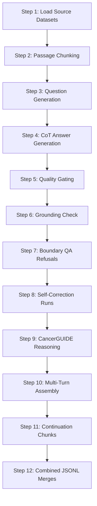

# Technical Blueprint: Rebuilding the PubMed Oncology Datagen Pipeline (`pubmed_datagen_v2_jupyterlab.ipynb`)

This document provides a highly detailed architectural analysis of the **PubMed Oncology Datagen (v2)** pipeline, and reverse-engineers the notebook into a production-grade blueprint prompt.

If you are teaching developers or creating a training video on **automated synthetic dataset generation** (especially implementing advanced alignments like **Chain-of-Thought (CoT)** reasoning and **Self-Correction Refusals** without heavy agentic frameworks), this guide is the ultimate technical walkthrough.

---

## Technical Architecture of the Datagen Pipeline

The `pubmed_datagen_v2_jupyterlab.ipynb` notebook does not use complex agentic frameworks. It relies entirely on Python's core `asyncio` batching concurrency plus the native `openai` client. This keeps execution deterministic, ultra-fast, and cheap. 

The pipeline runs in **12 Sequential Steps**:



### 1. Load cleaned PubMed abstracts + CancerGUIDE cases
Loads raw textual outputs cleaned by `scripts/clean_pubmed.py`:
* **PubMed Dataset:** ~100,000 abstracts partitioned across 11 cancer classifications.
* **CancerGUIDE Dataset:** 316 synthetic oncology notes with structured patient metrics and chemical pathways.

### 2. Passage Chunking (Sentence Boundary Sensing via pySBD)
To act as clean context windows (anchors) for RAG modeling, raw textual inputs are split into balanced blocks (passages). 

Instead of crude character-based splitters that break sentences mid-word or generic splitters that fail on complex medical terms, this step implements **pysbd (Python Sentence Boundary Disambiguation)** with custom rules to preserve abbreviations (e.g., `"Dr."`, `"St."`, `"P. value"`, `"i.e."`, `"e.g."`):
* **No Truncations:** Groups complete sentences into chunks up to `CHUNK_SIZE = 1500` characters.
* **Semantic Sentence Overlap:** Implements `OVERLAP_SENTENCES = 2`, which copies the last 2 trailing sentences from the previous chunk (ensured to be complete and fully contextual) to act as some overlapping head context for the next chunk, preventing information splitting.

### 3. Question Generation
For each passage, an LLM is prompted to write a list of high-quality diagnostic and treatment questions that **can** be definitively answered using only the provided context.

### 4. CoT Answer Generation using Qwen3-235B Thinking Model
The generated question + source context are passed to a reasoning model. The model writes standard oncology responses including `<think>...</think>` tags before the answer. The model thinks through:
* Pathophysiological mechanisms
* Clinical evidence lines
* Staging, pathways, and toxicity parameters

### 5. Quality Gating
An evaluation judge (LLM-as-a-judge) verifies that the generated answers strictly match clinical standards and that the `<think>` block contains deep clinical reasoning.

### 6. Anti-Hallucination: Grounding Check
The generated answers are audited against the source context to ensure that **no claims or PMIDs are fabricated**. If any claim isn't natively supported by the text, the item is purged or corrected.

### 7. Anti-Hallucination: "Beyond the Evidence" QA (Boundary Awareness)
This is an incredibly advanced alignment step. The generator writes questions that **cannot** be answered from the provided abstract (boundary questions), and trains the model to write clean, honest refusal sequences (e.g., *"The available clinical study does not address the overall survival rates for this subpopulation. Further randomized trials are required..."*).

### 8. Anti-Hallucination: Self-Correction Sequences
Generates a multi-turn conversation where:
1. The model initially outputs a slightly incorrect, common medical assumption.
2. The user pushes back (e.g., *"Are you sure? Recent trials actually showed..."*).
3. The model corrects itself in a `<think>` block and delivers the corrected consensus.
*(During LoRA SFT/DPO training, the first incorrect turn is loss-masked so the model only learns the correction sequence).*

### 9. CancerGUIDE Treatment Reasoning
Translates raw structured clinical case notes inside Microsoft's dataset into natural clinical multi-turn consultations.

### 10/11/12. Multi-Turn Assembly, Continuation and Merging
Packs conversations, adds system prompt guidelines, incorporates raw medical context continuation passages (for domain adaptation), and merges them into the final training-ready `.jsonl` files.

---

## Re-Engineering Blueprint: The Generative AI Prompt

Use this production-grade, highly detailed system development prompt in your LLM workflows to reconstruct this entire pipeline notebook from scratch:

```text
Act as a Principal Data Synthesis and Alignment Architect. Your task is to write a highly detailed, professional-grade, multi-turn Jupyter notebook in Python representing the entire "PubMed Oncologist Datagen Pipeline v2". 

Your notebook must be self-contained, using only are standard asyncio libraries, the native openai SDK, and typical data science dependencies (pandas, tqdm). Do not use indexing or agentic frameworks like LangChain or LlamaIndex.

Ensure the generated notebook contains the following cells and structures in order:

### Section 1: Configuration & Environment Setup
- Import: asyncio, os, json, random, re, pandas, tqdm, and openai.
- Set up dot-env configuration variables for endpoints: `OPENAI_API_KEY`, `OPENAI_BASE_URL` (supporting vLLM, Aphrodite, or OpenRouter), and `MODEL_NAME = "Qwen/Qwen3-235B-Instruct-Thinking"`.

### Section 2: Concurrency & Async Limiter Classes
- Design an async helper class `AsyncLimiter` or a semaphore-based executor that manages concurrent API calls gracefully:
  - Supports `MAX_CONCURRENT_CALLS` to prevent rate-limiting or compute thread lockups on discrete GPUs.
  - Implements adaptive exponential backoff re-tries on API failure.

### Section 3: Dataset Loading & Extraction
- Implement a function `load_source_data(source_dir)` that dynamically loads:
  - Processed PubMed tumor Abstract JSONL files from `/data/source-clean/`.
  - Microsoft CancerGUIDE synthetic oncology note files (`cancerguide_structured.jsonl`, `cancerguide_unstructured.jsonl`).
- Log row densities and output category breakdowns.

### Section 4: Grounded Oncology Questions Generator (RAG Pipeline)
- Write an async function `generate_grounded_questions(ContextPassage)`.
- System Prompt: "You are a clinical academic auditor. Write exactly 5 highly specific oncology diagnostics, testing, or therapeutic questions that can be answered with 100% certainty using only the facts inside the provided passage."
- Parse output to extract a list of raw questions.

### Section 5: Chain-of-Thought (CoT) Answer Generator
- Write an async function `generate_cot_answers(Question, ContextPassage)`.
- System Prompt: "You are a world-class clinical oncologist. Answer the user question by reasoning step-by-step. You MUST begin your response with <think>...</think> tags where you reason through tumor biology, chemical pathways, clinical guidelines, and toxicities before providing your final grounded answer."
- Force the output formats to preserve the `<think>` reasoning block natively inside the JSON payloads.

### Section 6: Quality Gate & Grounding Audit (LLM-as-a-Judge)
- Implement `audit_answer_grounding(Question, Answer, SourceContext)`.
- System Prompt: "Analyze the generated question and answer against the source context. Audit each claim. Output a strict JSON structure: `{\"is_grounded\": true/false, \"errors\": [\"list of errors if some claim is fabricated or isn't supported by the context\"]}`."
- Filter out failing rows dynamically.

### Section 7: Anti-Hallucination - Boundary Refusals Generator (Beyond Evidence)
- Write `generate_boundary_question_and_refusal(SourceContext)`.
- System Prompt: "You are an anti-hallucination dataset engineer. Identify what information is MISSING from the source context. Write a question about that missing element (e.g., exact overall survival rates, subpopulation trial counts). Then, write the model's response acknowledging its pre-trained cutoff limitations and refusing to speculate, stating clearly: 'The available literature does not provide enough evidence on...'"
- This teaches the model cognitive boundary awareness.

### Section 8: Anti-Hallucination - Self-Correction Synthesizer
- Write `generate_self_correction_conversation(Question, CorrectAnswer)`.
- Generate a 3-turn sequence:
  1. User asks the question.
  2. Assistant responds with a slightly incorrect medical estimate or common clinical misconception.
  3. User pushes back: "That value doesn't align with the randomized clinical trials. Could you reconsider?"
  4. Assistant outputs: `<think>Acknowledge error... re-verify... correct...</think> You are completely correct. I apologize. In the trial, the exact value was..."
- This teaches self-correction capabilities.

### Section 9: Microsoft CancerGUIDE Clinical Case Notebook Translator
- Write `translate_cancerguide_cases(CaseNote, Recommendations)`.
- Structure the raw jsonl metrics and notes into high-quality clinical multi-turn reasoning conversations where doctors analyze treatment pathways and chemotherapy strategies.

### Section 10: Stratified Assembly & Shuffled Combined JSONL Merge
- Merge all 4 generated subsets:
  - Grounded Clinical CoT Questions and Answers (~40%)
  - Boundary Refusal Sequences (~20%)
  - Conversational Self-Correction Scenarios (~20%)
  - CancerGUIDE Case Notebook Consultations (~20%)
- Apply stratified equal category constraints (equal counts of Bone, Stomach, Breast, Ovarian, etc.).
- Convert outputs to standard ShareGPT list shapes: `[{"from": "system/human/gpt", "value": "..."}]`.
- Deterministically shuffle, pack, and export clean, packed files ready for Unsloth fine-tuning.
```
