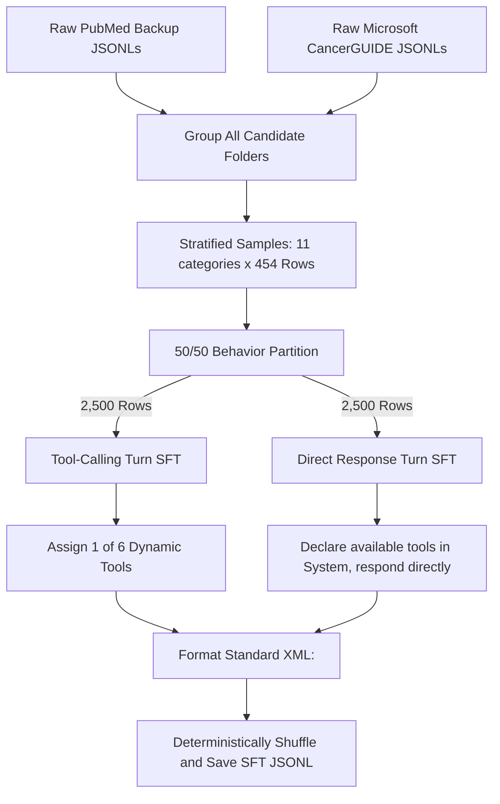
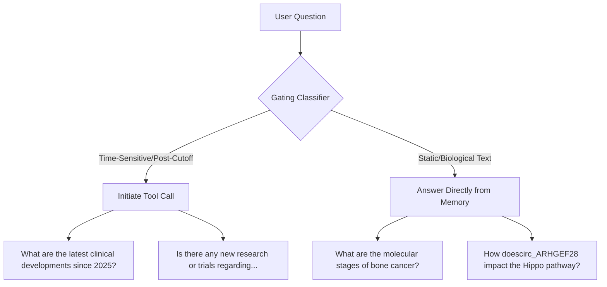

# Lessons Learned: Overriding Catastrophic Forgetting & Generalizing Tool Calling in LLM Fine-Tuning

This guide documents the design flaws, failure modes, and architectural solutions discovered while fine-tuning **MedGemma 27B** with Unsloth for clinical oncology reasoning and dynamic tool use. 

If you are teaching a model complex domain expertise (like medicine, law, or finance) while expecting it to keep its pre-trained ability to interface with external tools (like APIs, search engines, or database queries), this case study documents the classic traps and how to overcome them.

---

## The Core Problem: Catastrophic Forgetting in SFT

Base models are pre-trained on millions of diverse environments. They learn **functional relationships** (e.g., *"Read the tools listed in the system prompt -> Extract the correct tool schema -> Format arguments as XML/JSON"*).

However, during supervised fine-tuning (SFT):
1. **The Content Focus Trap:** If you fine-tune a model *only* on clinical question-and-answer pairs, the aggressive gradient updates erase the weights responsible for system-prompt tool routing. The model gains deep clinical knowledge but completely "forgets" how to interact with its tooling environment.
2. **The Formatting Lock-In:** To fix this, developers often inject synthetic tool-use examples into the SFT data. But if this data is not constructed with strict variance, the model's attention heads find the easiest mathematical shortcut to minimize loss: **Rote memorization**.

---

## Architectural Failure Modes (The "How NOT to Do It" Guide)

### Failure Mode 1: Static Suffix Overfitting (The Single Tool Name Trap)
* **What We Did Wrong:** We generated tool-calling SFT examples using only **one** static tool name: `deep_research_pubmed`.
* **The Result:** Instead of keeping its pre-trained dynamic tool-routing circuit alive, the model memorized the literal character combination `<call:deep_research_pubmed>`. When deployed inside actual production backends (like OpenWebUI or custom API agents) with a different tool name (e.g., `google_search` or `literature_db`), the model failed. It either outputted its old, hardcoded tag or failed to print clean closing brackets because it never learned the abstract concept of matching system prompt names with dynamic tags.

### Failure Mode 2: Extreme Behavioral Selection Bias (The "Always Call a Tool" Puppet)
* **What We Did Wrong:** Our first tool SFT dataset consisted of 100% tool-calling samples.
* **The Result:** A standard smart base model evaluates whether its internal knowledge is sufficient or if it needs to query an external source. Because our SFT data trained it *only* to call tools, the model completely lost its confidence. It became a puppet, initiating tool queries for trivial questions it already knew how to answer. At inference, it refused to answer directly—acting completely paralyzed unless a user explicitly forced it by writing *"Do not use a tool"* in the user prompt.

### Failure Mode 3: Group Selection Starvation (Imbalanced Datasets)
* **What We Did Wrong:** When capping the dataset budget to optimize training time (e.g., slicing to 5,000 examples), the generator script collected examples sequentially from category directories and exited once the limit was reached.
* **The Result:** Sequential slicing starved the latter half of our oncology classes. The model trained heavily on Breast, Colon, and Brain cancers, but had zero representation for Lung, Kidney, Gastric, or Prostate cancers. This imbalanced dataset severely weakened the model's specializations across other oncology subjects.

### Failure Mode 4: Silent Exclusion of Sibling Datasources (The Sibling Folder Trap)
* **What We Did Wrong:** The original raw project data relied on two distinct, independent pipelines: PubMed oncology abstracts and Microsoft's **CancerGUIDE** patient treatment case studies. Because the CancerGUIDE files were stored under a separate sibling directory (`cancerguide_reasoning/`), the dataset generator was hardcoded to only compile paths located inside the sequential `qa_validated/` folder.
* **The Result:** Microsoft's CancerGUIDE dataset was silently completely ignored during augmentation. The model was trained 100% on abstract literature queries, losing major clinical exposure to actual patient case histories and chemotherapy recommendations.

---

## The Solution: Strata-Balanced 50/50 Multi-Tool Generation

To force the model to behave like an intelligent, selective agent on deployment, we completely redesigned our dataset generator script (`augment_tool_calling_data.py`) to build the training data correctly from the start.



### 1. Multi-Source Stratified Equal Sampling
The script now dynamically scans, combines, and merges candidates from **both independent pipelines** (the 10 files in `qa_validated/` + the 1 file in `cancerguide_reasoning/`):
```python
candidate_files = sorted((source_dir / DATASET_NAME / "qa_validated").glob("*.jsonl"))
guide_files = sorted((source_dir / DATASET_NAME / "cancerguide_reasoning").glob("*.jsonl"))

# Dynamically merge candidate file pools
all_files = candidate_files + guide_files
```
It divides your target maximum cap evenly among all **11 registered categories**:
$$\text{Samples drawn per category} = \frac{\text{Total Target Sample Limit}}{11}$$

This guarantees that Microsoft's CancerGUIDE is fully integrated into training and given identical, balanced representational density with the PubMed files (exactly 91 rows of each per 1,000 sample cap).

### 2. Multi-Tool Diversity (Breaking string memorization)
We registered **6 dynamic, realistic oncology tools** inside the generator:
* `deep_research_pubmed`
* `clinical_trials_api`
* `oncology_guidelines_db`
* `biomed_evidence_search`
* `medline_lookup`
* `cancer_drug_registry`

The script deterministically rotates which tool is available per sequence. This variation makes it mathematically impossible for gradient descent to solve loss by memorizing a hardcoded tag string—forcing the model's attention heads to read the active tool format in the system prompt.

### 3. Native 50/50 Behavior Mix (Teaching "When to Call")
Instead of generating pure tool calls, the generator structures:
* **50% Tool-Calling Examples:** System prompt defines a dynamic tool → User question → Model outputs `<call name="...">` -> receiving `<response name="...">` -> Assistant provides evidence synthesis.
* **50% Direct-Response Examples:** The system prompt defines the exact same tools as available, but the Assistant answers the user directly from memory *without* launching a call.

This teaches the model **how** to write tool calls, but also teaches it **when not** to call them, allowing it to evaluate its parameters natively and selectively invoke APIs exactly like a pre-trained base model.

---

## High-Quality Generic XML Bracket Standards

Rather than using dynamic start and close tags (like `<call:some_tool>...</call:some_tool>`), which requires the model to memorize infinite spelling variants for closing tags, we standardize on a **Generic XML Attribute Protocol**:

* **Tool Call Syntax:**
  ```xml
  <call name="clinical_trials_api">{"query": "HER2 breast cancer trials"}</call>
  ```
* **Tool Response Syntax:**
  ```xml
  <response name="clinical_trials_api">
  [Trial results...]
  </response>
  ```

Because `<call name="...">` keeps the closing tag (`</call>`) constant regardless of the tool, the model is highly responsive, portable, and extremely easy to integrate into modern hosting servers (Ollama, vLLM) and frontends (OpenWebUI).

---

## Semantic Intent-Based Gating (Temporal Cognitive Gating)

### The Advanced Cognitive Trap: Over-Shuffled Behavior Split
If SFT/DPO datasets shuffle the `use_tool=True` and `use_tool=False` splits across identical styles of questions, the model is trained on a **non-deterministic layout**. It learns that calling a tool and answering directly are interchangeable options. It develops a loose probabilistic average rather than **semantic decision logic**.

At inference, the model will randomly decide whether or not to trigger tools, ignoring clear linguistic cues.



### The Solution: Explicit Gating Injection
To teach the model to be self-aware of its temporal knowledge cutoff, we inject explicit **temporal intent vectors** into the SFT generator.

1. **For Tool-Calling Examples (`use_tool=True`):**
   We dynamically rewrite the user questions with time-sensitive qualifiers, guidelines requests, or recent-discovery prompts. The question becomes:
   * *"What are the **latest clinical trial updates** for..."*
   * *"What is the **most recent data** or recommendations since 2025 regarding..."*
   * *"According to **current updated treatment guidelines**, what is..."*
   
   The model associates time-restricted keywords directly with the `<call>` trigger behavior.

2. **For Direct-Response Examples (`use_tool=False`):**
   We keep the user questions focused on classic, static biological structures, definitions, and biochemical mechanisms:
   * *"What is the standard staging system of..."*
   * *"How does the deletion/mutation of [gene] impact..."*
   * *"What is the molecular pathway of..."*

   The model associates static textbook definitions with immediate, direct responses from its parametric memory.

This simple semantic alignment trains the model to perform **Temporal Gating** natively—intelligently calling its research browser when a user asks for current developments, while conserving latency and responding instantly when asked about established scientific principles.

---

## Architectural Separation of Concerns: The Configuration Clutter Trap

### The Dev-Ops Failure Mode: Double-Tracking Config Limits
* **What We Did Wrong:** Previously, our dataset generator script scraped the fine-tuning Python notebooks directly to detect parameter constants (like `SFT_MAX_EXAMPLES` or `DPO_MAX_PAIRS`) and then auto-scaled the output files to match those counts.
* **The Result:** This created a tightly coupled, confusing loop where limit settings had to be managed and tracked in multiple places. If you scaled down SFT in the notebook for a quick trial run, it silently scaled or broke your master backend dataset compilation scripts.

### The Clean Architecture Solution
We established a strict **Separation of Concerns** between raw dataset generation and notebook execution:

1. **The Compiler’s Responsibility:** The generator script (`augment_tool_calling_data.py`) has **zero dynamic dependencies** on the notebooks. It simply compiles your master, balanced JSONL datasets directly from the source directory, or accepts an explicit, hardcoded threshold argument natively in the terminal (e.g., `--max-tool-examples 1000`).
2. **The Notebook’s Responsibility:** Slicing, sampling, or dataset capping for diagnostic runs is configured **entirely inside the notebook load variables** natively during runtime loading using standard Python slicing filters:
   ```python
   # Controlled exclusively inside the notebook loading cells
   SFT_MAX_EXAMPLES = 1000  # Set to e.g., 1000 for a rapid diagnostic test run, None = use full file
   
   if SFT_MAX_EXAMPLES is not None and len(raw_rows) > SFT_MAX_EXAMPLES:
       raw_rows = raw_rows[:SFT_MAX_EXAMPLES]
   ```

This architecture keeps backend generator pipelines completely decoupled from front-end notebook parameter adjustments, making the entire code base clean, modular, and easy to maintain.


