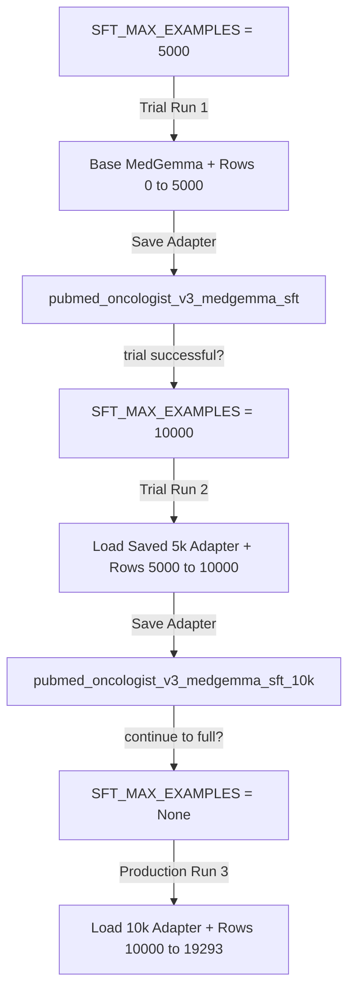

# PubMed Oncology MedGemma 27B Text SFT with Dynamic Slicing & Continuation (v3_slicing)

This script automates the dynamic dataset slicing and continuation process. It allows you to train your model incrementally (e.g., 5,000 -> 10,000 -> 19,293) without repeating previously trained examples and avoiding data duplication, while keeping your optimizer completely clean.

---

## The Workflow Map: How to Dynamic-Slice & Continue

To run incremental training steps, your notebook uses the configuration variables below to automatically load the correct base adapter from the previous run on disk, slice the dataset to ONLY read the unseen lines, and commence training:



---

## Implementation Code

Add this logic directly into **Cell 5 (2. Load Dataset)** and **Cell 9 (4. Load Model)** inside your active [v3 SFT Notebook](training/pubmed/notebooks/loras/medgemma/v3/pubmed_sft_training_medgemma_v3.ipynb).

### 1. The Dataset Loading Cell (Cell 5 Replacement)
```python
import json, os
from collections import defaultdict
from datasets import Dataset as HFDataset

print(f"LOADING TOOL-CALLING SFT DATA with DYNAMIC SLICING")
print(f"  File: {INPUT_DATA_FILE}")

# =========================== SAMPLE LIMITS & INCREMENTAL GATING ===========================
# SFT_MAX_EXAMPLES  = the numeric cap target (e.g. 5000, 10000, or None for full 19,293 file)
# PREVIOUS_RUN_CAP  = the number of rows already trained on in previous runs (e.g. 0, 5000, 10000)
# ===========================================================================================
SFT_MAX_EXAMPLES = 5000  
PREVIOUS_RUN_CAP = 0     # Set to 5000 on Run 2 (10k), and 10000 on Run 3 (Full/None)
# ===========================================================================================

raw_rows = []
cancer_type_counts = defaultdict(int)
source_counts = defaultdict(int)
system_prompts_by_cancer = {}  # cancer_type -> system prompt text

with open(INPUT_DATA_FILE) as f:
    for line in f:
        row = json.loads(line)

        cancer = row.get("cancer_type", "unknown")
        source = row.get("source", "unknown")
        cancer_type_counts[cancer] += 1
        source_counts[source] += 1

        # Keep messages format intact for tool-calling SFT.
        if "messages" in row:
            raw_rows.append({"messages": row["messages"]})
            # Extract system prompt if first message is system
            if row["messages"] and row["messages"][0].get("role") == "system":
                sys_msg = row["messages"][0].get("content", "")
                if sys_msg and cancer not in system_prompts_by_cancer:
                    system_prompts_by_cancer[cancer] = sys_msg
        elif "conversations" in row:
            raw_rows.append({"conversations": row["conversations"]})
            # Extract system prompt if first turn is system
            if row["conversations"] and row["conversations"][0].get("from") == "system":
                sys_msg = row["conversations"][0].get("value", "")
                if sys_msg and cancer not in system_prompts_by_cancer:
                    system_prompts_by_cancer[cancer] = sys_msg
        else:
            raise ValueError("Row missing both 'messages' and 'conversations'")

# ── Dynamic Slicing Gating Engine ──
total_rows_found = len(raw_rows)

if PREVIOUS_RUN_CAP > 0:
    print(f"  Continuation: Slicing out first {PREVIOUS_RUN_CAP:,} rows trained in previous passes...")
    raw_rows = raw_rows[PREVIOUS_RUN_CAP:]

if SFT_MAX_EXAMPLES is not None:
    # Adjust remaining limit count relative to what we've already parsed
    remaining_limit = SFT_MAX_EXAMPLES - PREVIOUS_RUN_CAP
    if remaining_limit > 0 and len(raw_rows) > remaining_limit:
        print(f"  Capping remaining slice size to target limit ({remaining_limit:,} rows)...")
        raw_rows = raw_rows[:remaining_limit]

dataset = HFDataset.from_list(raw_rows)

print(f"\n{'='*50}")
print(f"Total dataset loaded: {len(dataset)} conversations")
print(f"Cancer types: {len(cancer_type_counts)}")
print(f"Sources: {len(source_counts)}")
print(f"Unique system prompts: {len(system_prompts_by_cancer)}")
print(f"Columns: {dataset.column_names}")
```

### 2. The Model Loading Constants (Cell 3 / Step 2 Configuration)
To perform the continuation load, adjust your SFT config block dynamically.

* **For Run 1 (0 to 5,000):**
  ```python
  BASE_LLM = "unsloth/medgemma-27b-text-it-unsloth-bnb-4bit"
  SFT_MAX_EXAMPLES = 5000
  PREVIOUS_RUN_CAP = 0
  ```
  *(Output Adapter saves to: `/pubmed_oncologist_v3_medgemma_sft`)*

* **For Run 2 (5,000 to 10,000):**
  Configure the notebook to load the Phase 1 trial output, slice-off the first 5k rows, and train only on the next 5k rows:
  ```python
  BASE_LLM = "/training/pubmed/output/v3/pubmed_oncologist_v3_medgemma_sft/lora_adapters"
  SFT_MAX_EXAMPLES = 10000
  PREVIOUS_RUN_CAP = 5000
  ```
  *(Change `OUTPUT_BASE_DIR` or save parameters slightly to prevent overwriting checkpoint-0 variables of your prior run, e.g. saving adapter to `/v3/pubmed_oncologist_v3_medgemma_sft_10k/`)*

* **For Run 3 (10,000 to 19,293):**
  Load the 10k adapter, slice-off the first 10,000 rows, and train on the final 9,293 rows:
  ```python
  BASE_LLM = "/training/pubmed/output/v3/pubmed_oncologist_v3_medgemma_sft_10k/lora_adapters"
  SFT_MAX_EXAMPLES = None # Pulls all remaining rows
  PREVIOUS_RUN_CAP = 10000
  ```
  *(Output Adapter saves to final production lora: `/v3/pubmed_oncologist_v3_medgemma_sft_final/`)*
