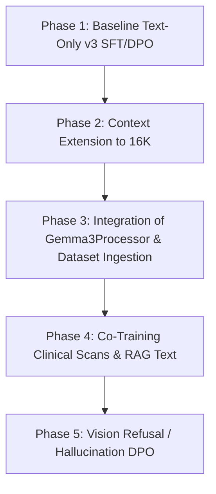

# Multimodal Migration Blueprint: Transitioning to MedGemma Vision (Gemma 3)

The goal of this architectural blueprint is to assess the viability, technical steps, memory footprint, and critical trade-offs of switching from our text-only fine-tuning pipeline to Google's multimodal **MedGemma 27B IT** model (built on the Gemma 3 architecture), which natively handles medical imaging inputs (e.g., CT, MRI, pathology scans) via integrated SigLIP-based vision encoders.

---

## 1. Context Window Constraints: Is 4096 Tokens Enough?

Historically, **4096 tokens is extremely cramped for clinical oncology.** Adding high-fidelity vision inputs makes this limitation even more acute.

### The Token Math of a Multimodal Session
In a unified 4096 context window, introducing a single medical scan significantly inflates the token budget:
* **System Prompt:** ~300 to 500 tokens (including Oncologist Persona + selective Tool-Call guidelines).
* **Multi-Abstract Passages (RAG):** ~1,500 to 2,000 tokens (essential for multi-paper cross-referencing).
* **Visual Token Footprint (Gemma 3 SigLIP):** ~256 to 1024 tokens *per image* depending on resolution and slicing parameters.
* **Oncology Cognitive Thought Chain (`<think>` block):** ~500 to 1,500 tokens.
* **Clinical Recommendation Suffix:** ~300 to 800 tokens.

$$ \text{Total Required Tokens} \approx 500 + 2000 + 1024 + 1500 + 800 \approx 5824 \text{ tokens} $$

At a `MAX_SEQ_LENGTH = 4096`, **cross-referencing structured notes, reading multiple papers, and reasoning step-by-step through a visual scan is mathematically impossible.**

### Resolution Strategy: Extending Gemma 3 context
Gemma 3 natively supports **up to 128K context windows** (though 8K to 32K is more practical for fine-tuning). Since we are using Flash Attention 2 on sm_120 (Blackwell), the memory overhead scales linearly with KV cache size rather than quadratically. Extending `MAX_SEQ_LENGTH` to **8192** or **16384** is highly recommended to unlock meaningful multimodal learning.

---

## 2. Hardware Resource Profiling (NVIDIA DGX Spark)

Our training hardware has **128 GB of unified CPU/GPU memory**. Currently, training the 4-bit quantized MedGemma 27B SFT script on text-only sequences uses **~64 GB of unified RAM**.

### Theoretical Headroom for Multimodal Training
Weight size for MedGemma 27B in 4-bit is incredibly compact:
* **Frozen weights + LoRA parameters:** ~16 to 18 GB actual memory.
* **Current text activation overhead:** ~45 to 48 GB (with gradients, optimizer states, and batch packing).

This leaves **~64 GB of unallocated unified RAM headroom** on the DGX.

### How Vision Scales Memory Requirements
1. **Activation Memory Scaling:**
   Vision models generate dense inter-token activation maps during forward and backward passes. While gradient checkpointing reduces this footprint, extending context lengths to $8192$ or $16384$ and feeding $1024$-token image grids will double active attention activations.
2. **LoRA Parameter Scaling:**
   If we freeze the SigLIP vision tower and the cross-attention projection layers (only training the LLM decoder's attention sub-layers), memory usage remains very stable. However, if we must tune the image projection heads or freeze fewer layers to adapt the vision encoder to greyscale clinical scans (e.g., MRI/CT tissues, which look fundamentally different from natural-domain images), LoRA trainable weights will scale.

### DeepSpeed Activation Offloading: The Unified Memory Fallacy
On a standard system with separate discrete GPUs and host CPUs (e.g., matching a typical x86 server with an H100 GPU and AMD EPYC CPU), DeepSpeed activation offloading (to host system RAM) is highly advantageous. It shifts activation tensors from a cramped pool of visual card VRAM (e.g., 24GB/80GB) into a massive system RAM buffer (e.g., 512GB/1TB).

However, **on unified memory architecture systems like the NVIDIA DGX Spark, standard CPU-RAM offloading yields no advantage.**
* **The Shared Pool Reality:** The CPU host memory and GPU memory physically share the exact same unified pool (128GB of LPDDR5X/HBM). There is no secondary larger pool of "host RAM" to offload to. 
* **The Consequences:** Instructing DeepSpeed to offload activations from the GPU accelerator context to System RAM simply moves data between pointers in the *same* physical 128GB memory space. Not only does this fail to prevent OOM, it introduces severe memory-bus overhead penalties as the processor actively moves blocks around the shared bus for no net gain.
* **The Persistent Exception (NVMe SSD Offloading):** Offloading activations to NVMe SSD files is the only offloading pattern that increases the net physical memory limit on unified systems. However, because PCIe/HBM file throughput transfers are orders of magnitude slower than direct memory access, this causes training speeds to plummet (often making steps take $10\times$ to $50\times$ longer). Under unified memory setups, we must prioritize **gradient checkpointing** and strict **loss masking** instead of memory offloading.

---

## 3. High-Fidelity Medical Vision Tuning Challenges

Medical imaging is fundamentally different from a typical natural-domain HuggingFace dataset (e.g., photos of everyday objects).

| Aspect | Natural Domain Vision (SigLIP default) | Medical Vision (MRI / CT / Pathology) |
|---|---|---|
| **Color Depth** | High-contrast RGB (3 channels) | Monochromatic / Greyscale (single channel, high depth) |
| **Spatial Details** | Large focal objects (centered foreground) | Tiny micrometastases, faint tissue density variances, margins |
| **Volumetric Depth** | Single static perspective | Volumetric stacks (serial coronal/axial cross-section loops) |

### Consequences of a Naive Switch
* **The "Grey Blur" Problem:** Pre-trained natural vision encoders mapping clinical grayscale slices often lose fine-grained diagnostic structures (such as bone borders or microcalcifications) due to resolution downsizes and feature projection mappings.
* **Lack of Multipage/Volumetric Alignment:** Standard vision LLMs take 1 single image. Real oncological diagnostics require looking at **comparative longitudinal scans** (e.g., CT from January vs CT from March) to measure RECIST response rates.

---

## 4. Phase-by-Phase Multimodal Migration Road



### Phase 1: Baseline Text-Only v3 SFT & DPO (Current Status)
* Run training on current versioned `v3` folders as a baseline control to evaluate logical reasoning strength beforehand.

### Phase 2: Context Extension to 16K (Text Only)
* Increase SFT/DPO sequence length context bounds inside [pubmed_sft_training_medgemma_v3.ipynb](training/pubmed/notebooks/loras/medgemma/v3/pubmed_sft_training_medgemma_v3.ipynb#L190).
* Ensure Flash Attention 2 behaves cleanly and measure SFT/DPO performance across longer passages without visual elements.

### Phase 3: Dataset Ingestion with `Gemma3Processor`
* Scale our dataset generator to accept image paths in SFT rows:
  ```json
  {
    "messages": [
      {"role": "user", "content": "Analyze this scan: <image>"},
      {"role": "assistant", "content": "<think>Clinical evaluation of scan...</think>\nBased on the MRI, a lesion is visible..."}
    ],
    "images": ["/data/scans/patient001_ct.png"]
  }
  ```
* Leverage `Gemma3Processor` to dynamically tokenize the text blocks, format the standard vision template, and process pixel coordinates.

### Phase 4: SFT Co-Training (Clinical Scans & Text)
* Hook the dataset into SFT training. Target LoRA projection parameters:
  ```python
  LORA_TARGET_MODULES = [
      "q_proj", "v_proj", "k_proj", "o_proj", # Decoder text adapters
      "multi_modal_projector.linear_1", "multi_modal_projector.linear_2" # Vision alignment adapter
  ]
  ```

### Phase 5: Vision DPO (Preflect Refusal Tuning)
* Incorporate image failures into the DPO pipeline:
  * **Chosen:** Gracefully refuse to diagnose when scan resolutions are too poor or when artifacts distort the tissue bounds.
  * **Rejected:** Confidently guessing clinical anomalies on corrupted/noisy image files.

---

## 5. Alternative Topologies: Modular Auxiliary Image Captioner

Instead of forcing the massive 27B model to process dense high-dimensional sensory pixel structures directly, a highly customizable and memory-advantageous alternative is to implement a **modular bipartite topology**.

```
                           +────────────────────────+
                           |  Raw Medical Scan      |
                           |  (MRI/CT Slices/DICOM) |
                           +───────────┬────────────+
                                       │
                                       ▼
                     +──────────────────────────────────+
                     |  Modular Auxiliary VLM           |
                     |  (e.g., Qwen2-VL-7B-Med / PaliG)  |
                     +─────────────────┬────────────────+
                                       │
                                       ├─► Generates detailed textual description,
                                       │   noting anomalies, locations, Hounsfield numbers,
                                       │   and contrast behaviors.
                                       ▼
                  +─────────────────────────────────────────+
                  |  Primary Clinical Reasoner (MG-27B Text) |
                  |  (processes text-descriptions via SFT)  |
                  +────────────────────┬────────────────────+
                                       │
                                       ▼
                  +─────────────────────────────────────────+
                  |  Clinical Diagnosis & Guideline Plan    |
                  +─────────────────────────────────────────+
```

### Advantages of a Modular Captioner Path
1. **Unbounded Context Preservation**:
   By converting dense visual pixel tensors into structured textual representations *before* passing them to the primary reasoner, you do not waste $1024$ tokens of your target context window on raw embeddings. This preserves the entire $16384$ sequence budget for dense multi-abstract literature synthesis (RAG) and reasoning paths.
2. **Infrastructure Distribution (Parallel Inference)**:
   The auxiliary model (e.g., a medical fine-tune of a 7B vision model) has a tiny hardware footprint. It can be running on a lighter auxiliary GPU (such as a single A5000 24GB or partitioned host cores) separate from the heavy-hitter MedGemma 27B model, which stays loaded in isolated cache cores on the DGX.
3. **Clinical Interpretability & Verification**:
   When training a model end-to-end (pixels $\to$ diagnosis), the reasoning process inside the model's visual projection weights is a "black box." It is impossible to verify whether the model correctly localized an MRI anomaly or simply got lucky. With a modular captioner:
   * The clinician can read the exact descriptive text generated by the visual analyzer.
   * If the captioner hallucinated or missed a tumor margin, the error is immediately visible and auditable in the prompt stream, preventing silent downstream diagnostics cascading failures.
4. **Independent Iterative Training**:
   You can update, refine, or swap the visual specialist model (training it purely on specific DICOM image classification datasets) without altering the weights, pipeline, or SFT of the primary clinical reasoning brain.

